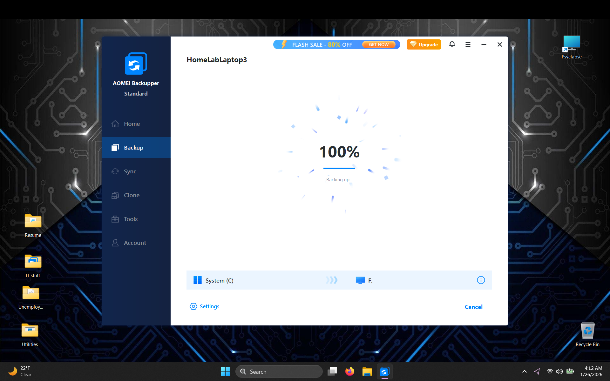
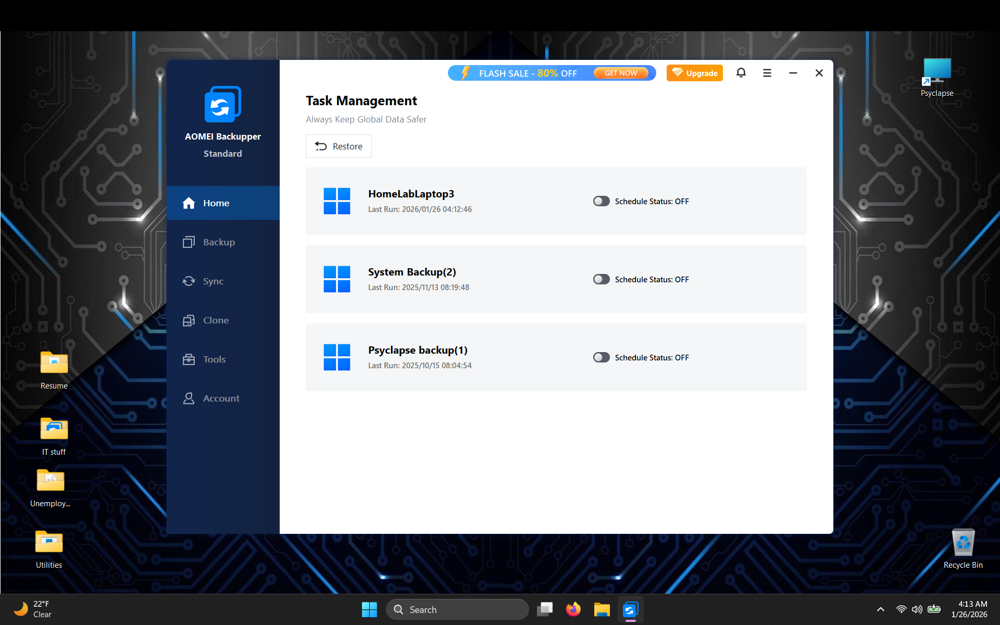

# Backups
  - Backups are one of the biggest defenses against cyber-attacks, hardware failure, or random chaos.

## My personal strategy
  - Local-only backups (no cloud).
  - Multiple off-line drives.
  - Periodic full backups (about once a month).

## Proof of execution
  
   - Latest completed backup.
    
  - Recent backup history (multiple restore points).

