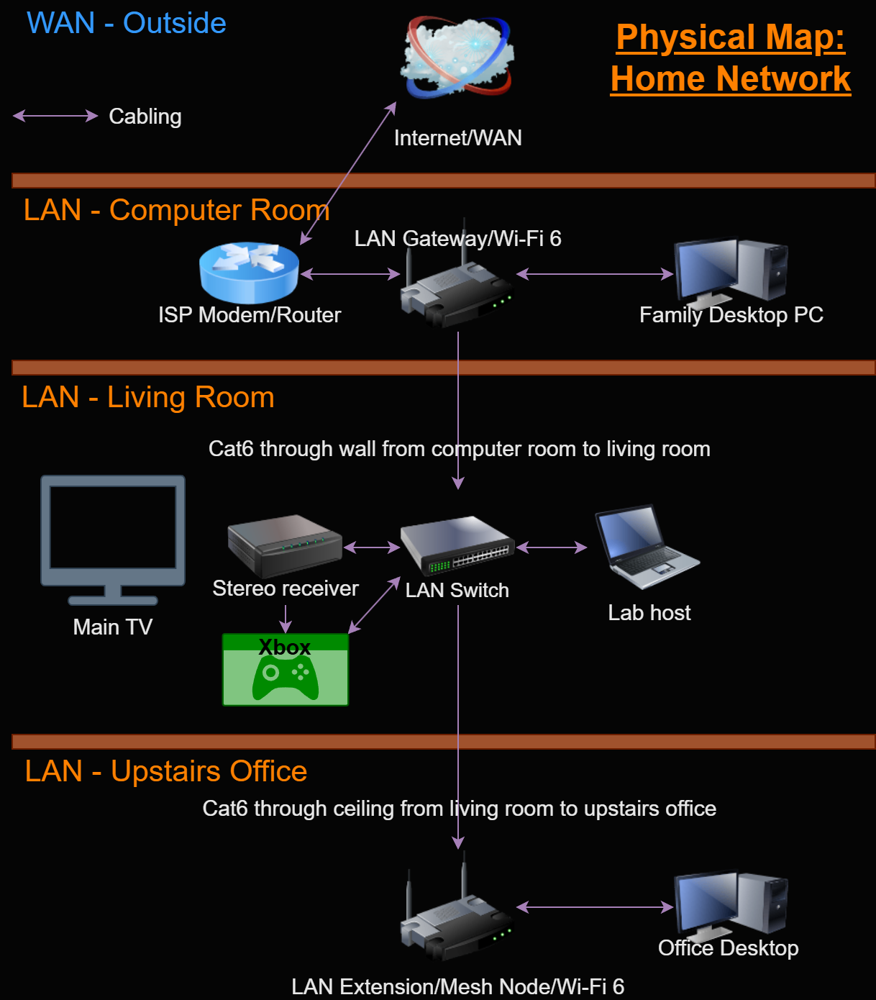
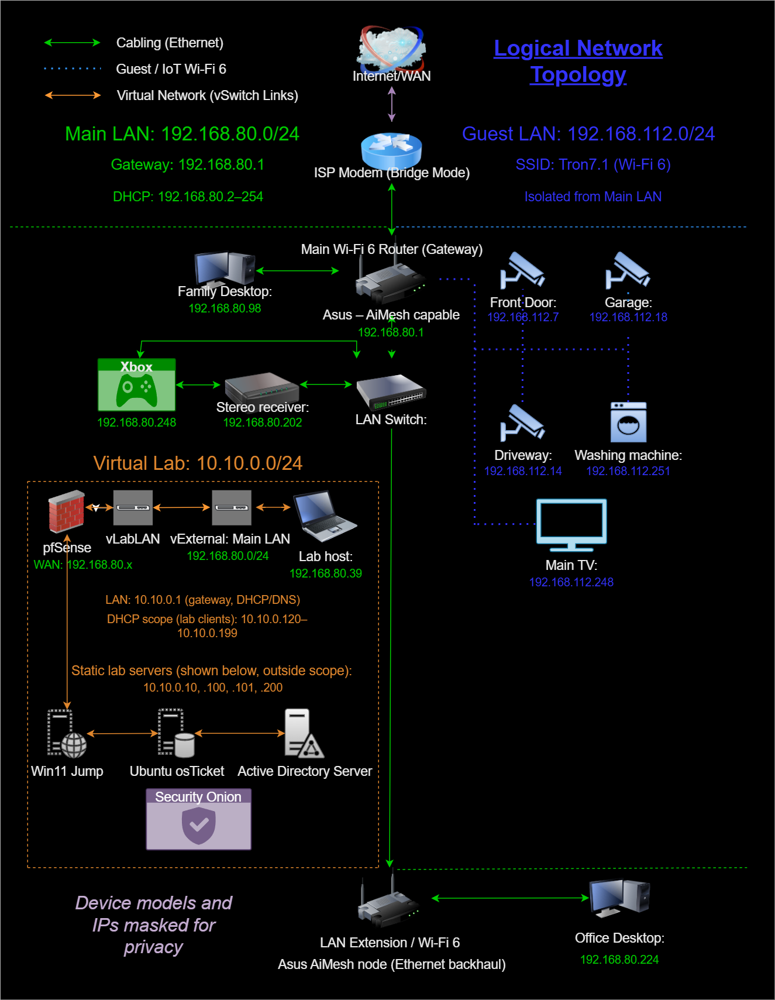

## Kev's IT Portfolio

This project was born on October 17th, 2025, and will continue to grow in detail and evolve as I explore more interests in the world of IT. I have worked with computers in some capacity most of my life, beginning with the Atari ST and Commodore Amiga. Being a gamer my whole life, maybe its only natural that I'm pulled towards IT Security as a career goal. But this is just the beginning, so to prepare for help desk and technical troubleshooting roles I have immersed myself in the world of ticketing systems, network troubleshooting, and documentation.
I am CompTIA A+, Network+, and Security+ certified. Obtaining these self credentials and creating this home lab is evidence that I am well prepared for work in the IT field. My hope is to find roles where I am surrounded by IT professionals of all kinds who can help train me in various higher level IT concepts such as network administration and IT security.

## Overview

  Using a hypervisor on my laptop, I simulate a real-world business environment where users connect through a firewall to internal services via a Windows jump box. This provides access to an Ubuntu Apache server running osTicket, a Windows server running an Active Directory domain, and a full Security Onion monitoring stack. This portfolio is designed to document what I built, how I built it, why I built it, what issues I ran into along the way, and how I fixed them. Included are many screenshots designed to prove that what I claim I built exists, and works. This includes the connections involved in my networking maps. They also tell the story of mistakes made along the way, and how I learned from them.

### Hardware
Laptop: Lenovo ThinkPad, Ryzen 7 7735HS, 64 GB RAM, 1 TB SSD

### Software
The host runs on Windows 11 Pro. The virtual machines are run in Hyper-V and are comprised of: pfSense, Windows 11 Pro, Windows Server 2022, Ubuntu 24.04.3 LTS, and Security Onion 2.4.201.

## Network Topology (Physical and Logical)
This visually documents the physical layout and logical segmentation of my home network, along with the VLANs, firewall, boundaries, and routing paths of my home lab.

- [Host Windows version](/Misc/HostWinVer.png)
  - My laptop runs Windows 11 Pro, version 25H2.
- [Host specs](/Misc/HostSpecs.png)
  - My laptop's system specifications.
- [My virtual switches](/Misc/My-virtual-switches.png)
  - Visual documentation of the virtual switches used in this home lab.
- [Proof of life!](/Misc/HomeLabRunning.png)
  - This shows Hyper-V, with all five virtual machines running.

### Physical Topology
  - My home network. The device this virtual home lab runs on is the "Lab Host" laptop in the middle.

*This displays the physical layout of my home network, including the ISP demarc, firewall/router, switches, access points, and where my home lab resides. This demonstrates my understanding of hardware placement, cabling, and how choices affect performance, reliability, and scalability.*

### Logical Topology
  - The digital map of my home network, with a detailed version of my home lab in the middle.

*This shows the logical structure of my home network, highlighting traffic flow through my virtual lab. It documents DHCP scopes and VLAN segmentation via pfSense, and multiple lab servers all monitored by Security Onion. This demonstrates my ability to design, secure, and document enterprise style network environments.*

# The Virtual Machines
  - Below are the pages detailing each of my virtual machines, in operational startup sequence.

## [pfSense](pfsense.md)
  - Firewall/router: VLAN segmentation.

## [Jump Box](jumpbox.md)
  - Windows 11 admin workstation: Manages all VMs.

## [Active Directory](AD-LAB-01.md)
  - Windows Server 2022 domain services (users/groups/GPO).

## [osTicket](osTicket.md)
  - Ubuntu + Apache + MariaDB: ticketing workflows.

## [Security Onion](SecOnion.md)
  - Ubuntu: lab-wide network monitoring/IDS.

# Side Projects
  - Misc troubleshooting / random IT activities / side quests.

## [Shredder](Shredder.md)
  - Broken shredder ticket

## [Backups](Backups.md)
  - A potent weapon.
    
