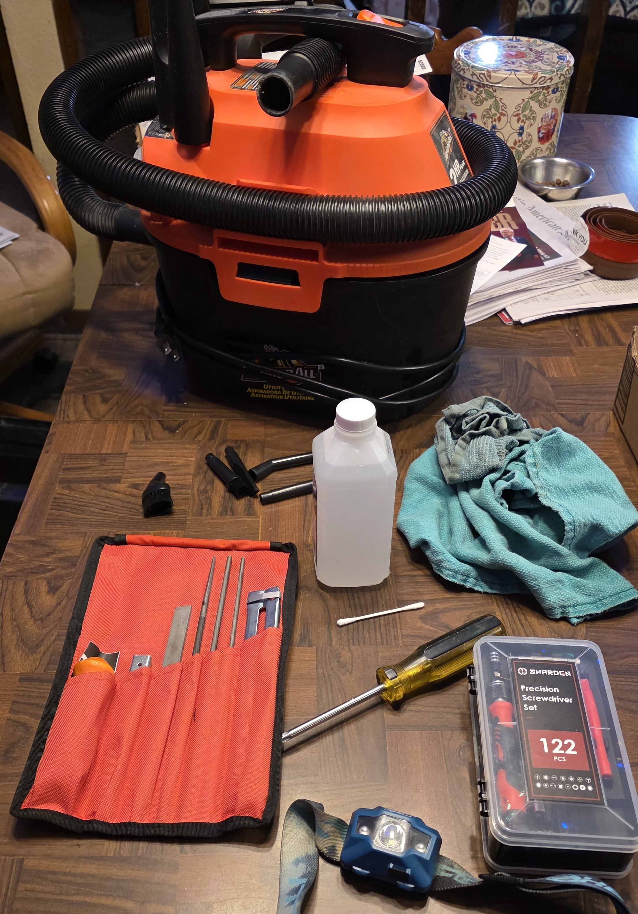
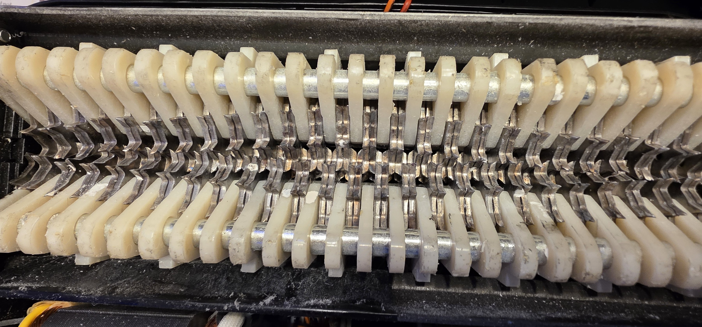

# Shredder teardown + cleanup
  - A home project happened today on January 28th. I decided to fix our shredder.

## What’s the issue?
  - "Auto-stop" would not engage, and an abnormal noise occured during operation.
  
## Approach (diagnosis → teardown → cleanup → test)
  - Unplugged and set it up on the table to dissasemble, in order to find the issue.
  - Discovered jammed material (2 credit cards) in the card slot, and found several plastic spacers with gouges and sharp edges sticking out.
  - Used a vacuum with precision attachments to remove paper dust and fragments.
  - Used tweezers to pull out several dozen tiny pieces of stuck paper.
  - Used a precision file set to file down the damaged plastic spacers.
  - Wetted several cotton tips with rubbing alcohol to clean pertinent areas.
  - Reassembled and tested the unit. Problems resolved.

## Tools used
  - Precision screwdriver set
  - Tweezers
  - Small shop-vac with precision tip.
  - Chainsaw tooth sharpening kit.
  - Isopropyl alcohol and cotton tips.
  
## Results
  - I shredded several pages, and two credit cards.
  - Auto-stop engages as intended, operating noise is normal.

## Photos

  
  

  
  

